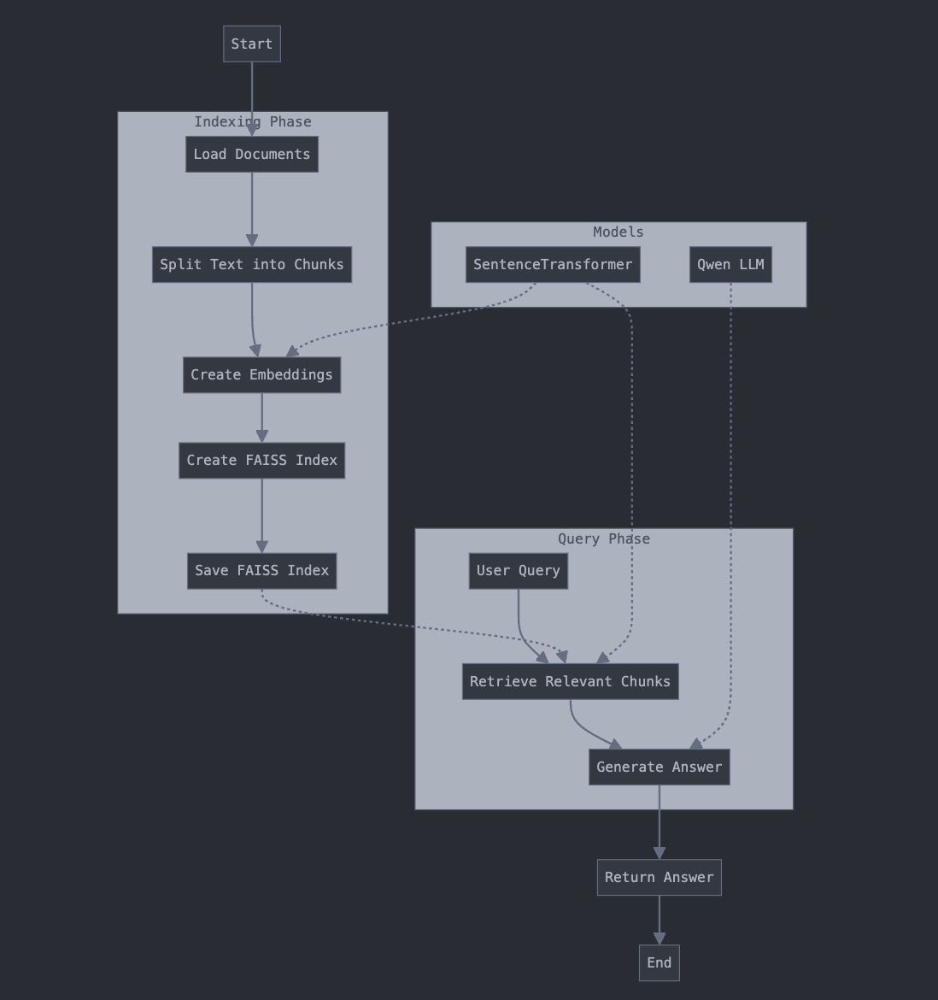

# Example about a very simple RAG system

This is a very simple example about how to build a **RAG system**.

The dataset is a list of documents about some tech topics.

**Explanation of the steps:**

The process of building the RAG (Retrieval-Augmented Generation) system in `app.py` involves several steps:

1. **Loading Documents**:
   - A list of documents is defined, each containing a title and content. These documents are loaded into the application.

2. **Splitting Text**:
   - The content of each document is split into smaller chunks using the `split_text` function. This makes it easier to process the text later.

3. **Loading SentenceTransformer Model**:
   - A pre-trained SentenceTransformer model (`paraphrase-MiniLM-L3-v2`) is loaded to generate embeddings for the text chunks.

4. **Batch Encoding**:
   - The text chunks are encoded in batches using the `batch_encode` function, which utilizes the SentenceTransformer model to create embeddings.

5. **Creating FAISS Index**:
   - A FAISS (Facebook AI Similarity Search) index is created using the generated embeddings. FAISS is a library developed by Facebook AI that enables efficient similarity search and clustering of dense vectors. By creating a FAISS index, we can quickly search for and retrieve the most similar text chunks based on their embeddings, which is crucial for the retrieval step in the RAG system.

6. **Saving FAISS Index**:
   - The FAISS index is saved to a temporary file using the `create_and_save_index` function.

7. **Retrieving Relevant Chunks**:
   - The `retrieve_relevant_chunks` function reads the FAISS index and retrieves the most relevant text chunks for a given query.

8. **Loading Qwen Model**:
   - The Qwen model (`Qwen/Qwen2.5-0.5B-Instruct`) is loaded along with its tokenizer. This model is used for generating answers based on the retrieved chunks.

9. **Generating Answers**:
   - The `generate_answer` function generates an answer to a query by providing the context (retrieved chunks) to the Qwen model.

10. **Processing RAG Query**:
    - The `rag_query` function processes a query by retrieving relevant chunks and generating an answer. This function combines the retrieval and generation steps to provide a final response.

11. **Executing Query**:
    - An example query is executed to demonstrate the RAG system. The query asks about solving problems related to Microsoft Excel, and the system retrieves relevant information and generates an answer.

The entire process is logged at various stages to provide insights into the system's operations and ensure smooth execution.

